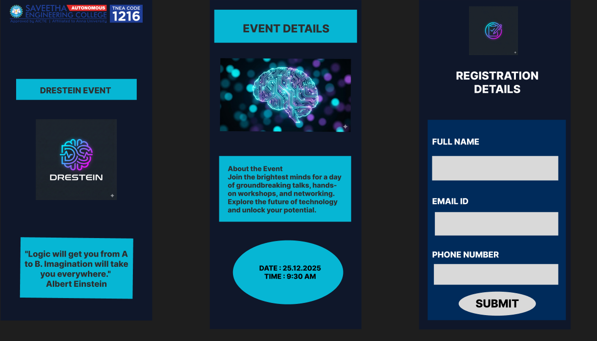

# Ex09 Event Registration Web Application
## Date:26.12.25

## AIM:
To design, develop and deploy a web application for event registration.

## DESIGN STEPS:

### Step 1:
Create a new frame.

### Step 2:
Select any one preset size of your choice.

### Step 3:
Select the shapes you need.

### Step 4:
Import images as needed.

### Step 5:
Create pages based on your need and link them.

### Step 6:

Validate the HTML and CSS code.

### Step 6:

Publish the website in the given URL.

## DESIGN TOOL:
Figma

## CODE:
```
<!DOCTYPE html>
<html>
  <head>
    <meta name="viewport" content="width=device-width, initial-scale=1" />
    <meta charset="utf-8" />
    <link rel="stylesheet" href="globals.css" />
    <link rel="stylesheet" href="style.css" />
  </head>
  <body>
    <div class="iphone-pro-max">
      
      <div class="rectangle"></div>
      <div class="text-wrapper">DRESTEIN EVENT</div>
      <div class="div"></div>
      <p class="logic-will-get-you">
        &#34;Logic will get you from A to B. Imagination will take you everywhere.&#34; <br />Albert Einstein
      </p>
    </div>
  </body>
</html>
<!DOCTYPE html>
<html>
  <head>
    <meta name="viewport" content="width=device-width, initial-scale=1" />
    <meta charset="utf-8" />
    <link rel="stylesheet" href="globals.css" />
    <link rel="stylesheet" href="style.css" />
  </head>
  <body>
    <div class="iphone-pro-max">
      
      <div class="rectangle"></div>
      <div class="text-wrapper">EVENT DETAILS</div>
      <div class="div"></div>
      <p class="about-the-event-join">
        About the Event <br />Join the brightest minds for a day of groundbreaking talks, hands-on workshops, and
        networking. Explore the future of technology and unlock your potential.
      </p>
      <div class="ellipse"></div>
      <p class="DATE-TIME">DATE : 25.12.2025<br />TIME : 9:30 AM</p>
    </div>
  </body>
</html>
<!DOCTYPE html>
<html>
  <head>
    <meta name="viewport" content="width=device-width, initial-scale=1" />
    <meta charset="utf-8" />
    <link rel="stylesheet" href="globals.css" />
    <link rel="stylesheet" href="style.css" />
  </head>
  <body>
    <div class="iphone-pro-max">
      <div class="text-wrapper">REGISTRATION DETAILS</div>
      
      <div class="rectangle"></div>
      <div class="ellipse"></div>
      <div class="div">SUBMIT</div>
      <div class="text-wrapper-2">PHONE NUMBER</div>
      <div class="text-wrapper-3">EMAIL ID</div>
      <div class="text-wrapper-4">FULL NAME</div>
      <div class="rectangle-2"></div>
      <div class="rectangle-3"></div>
      <div class="rectangle-4"></div>
    </div>
  </body>
</html>
```
## OUTPUT:

## RESULT:
The program to design, develop and deploy a web application for event registration is completed successfully.
